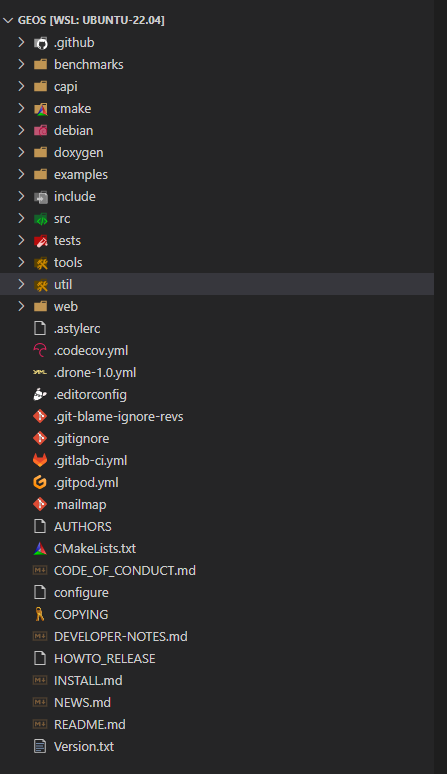
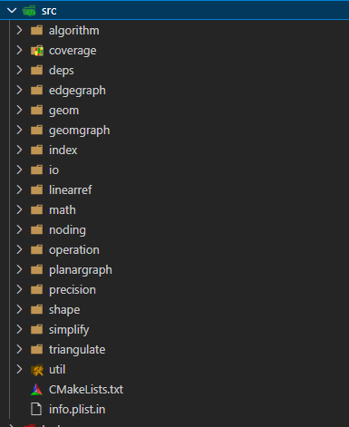

# GIS学习

- [GIS学习](#gis学习)
  - [1.GEOS](#1geos)
  - [2.JTS](#2jts)
  - [3.GDAL](#3gdal)
  - [4.PostGIS](#4postgis)
  - [5.QGIS](#5qgis)
  - [6.libgeotiff](#6libgeotiff)
  - [7.Geoserver](#7geoserver)
  - [8.GIS数据格式学习](#8gis数据格式学习)
  - [9.坐标系](#9坐标系)
  - [哨兵数据](#哨兵数据)

GIS主要围绕数据运行，主要为数据存储、数据分析、数据显示。

## 1.GEOS
&emsp;&emsp;GEOS作为矢量数据相关的库，作为GDAL、qgis以及PostGIS等程序的依赖。GEOS主要用C++以及C进行开发，不过作为JTS的C++/C的实现，所有的算法都现在JTS中进行实现，然后再GEOS中进行扩展。GEOS提供了空间对象模型以及相关方法：几何模型（点、线、面）、空间关系的判断（是否相交、包含、相邻等）、空间操作（联合、缓冲、面积、长度等测量）、空间索引（R-tree）以及wkt、wkb写入读写。阅读GEOS的源码了解矢量对象的构建以及算法的实现逻辑。从github上拉取[GEOS源码](https://github.com/libgeos/geos/ 'GEOS').GEOS编译，该项目采用cmake结构，先在项目根目录下创建build文件夹，在文件夹中执行`cmake ..`;然后执行`make -j4`;最后安装`sudo make install`,即完成geos编译以及安装。   
&emsp;&emsp;简单分析下源码结构，源码结构如下图所示。  

- 1、benchmarks为性能基准测试
- 2、capi为c语言的接口
- 3、cmake的相关配置
- 4、创建debian相关的deb可执行文件
- 5、doxygen格式文档
- 6、examples为geos的使用示例
- 7、include为头部文件对应实现为src
- 8、src主要的代码，作为重点阅读
- 9、tests测试相关
- 10、tools为ci/cd相关工具
- 11、util主要为geosop，为geos的命令行工具
- 12、web为官网的页面

虽然有很多文件夹，我们主要需要阅读的仅为src下的文件。然后我们具体查看下src文件夹下的具体代码。  

- 1、algorithm，从名称看即为算法相关的代码，主要为基础的几何算法，包括角度计算、距离计算、面积计算以及最小外接圆的计算算法等。
- 2、coverge，为矢量数据的验证，验证几何是否有效，发现几何之间的缝隙等
- 3、deps，依赖，这里主要为ryu，ryu为浮点小数的最小表示
- 4、edgegraph，几何边相关操作，
- 5、geom，定义几何对象相关类，如：点、线、面、三角形、外接矩形等
- 6、geomgraph，图形相关类，节点、边、带方向的边等
- 7、index，几何索引，二叉树索引，kd树索引等
- 8、io，geojson以及wkb格式读写操作
- 9、linearref
- 10、math
- 11、noding
- 12、operation，几何操作，包括缓冲区分析、叠加分析、聚类分析等
- 13、planargraph
- 14、precision
- 15、shape
- 16、simplify
- 17、triangulate，
- 18、util，通用的工具

geos中定义的几何相关的类主要包括Coordinate、Geometry（子类：Point、LineString、Polygon等）、position、triangle、
地理数据包括几何数据以及属性数据，在geos中主要的几何类为Geometry，其他的具体类型的几何像点、线以及面等都是继承于Geometry。
- 1、Geometry  
Geometry为抽象的数据类型，具体数据类型包括POINT、LINESTRING、LINERRING、POLYGON、MULTIPOINT、MULTILINESTRING、MULTIPOLYGON以及GEOMETRYCOLLECTION其中类型，这七种类型具有指定的顺序0-7.在geos中Geometry创建都是由GeometryFactory创建或进行销毁。
  - 1.1 userData：Geometry用userData来保存属性数据。
  - 1.2 SRID用来标识Geometry采用投影类型。
  - 1.3 Coordinate，geometry顶点，任何类型的geometry都包含coordinate
  - 1.4 geometryType，类型
  - 1.5 simple，当前geometry是否为简单几何
  - 1.6 dimension,维度，点为0维、线为一维、面为二维
  - 1.7 boundary, 边界，是一系列更低维度的geometry几何
  - 1.8 envelope, 外接矩形  
一些空间关系（DE-9IM框架和最小谓词集都是完备的、唯一的，可以较细的区分人类可辨识的空间拓扑关系。）  
  - 1.9 disjoint，判断两个几何是否分离，是intersect对立面
  - 1.10 touches，两个几何相互接触
  - 1.11 crosses，两个几何具有共同点，但不是包含关系
  - 1.12 within，几何在另一个几何内部
  - 1.13 contains，同within
  - 1.14 overlaps
  - 1.15 relate，两个geometry是否intersect
  - 1.16 equals，两个几何相等
  - 1.17 covers，所有geometry点都在另一个geometry中  
一些空间分析方法
  - 1.18 buffer，缓冲区分析
  - 1.19 convexhull，返回最小的凸多边形
  - 1.20 reverse，将geometry中的coordinate调转顺序。
  - 1.21 intersection，相交分析
  - 1.22 union，联合分析
  - 1.23 difference，类似于裁剪分析
  - 1.24 getCentroid，获取geometry质心
  - 1.25 isWithinDistance，判断两个geometry是否相距在指定距离范围内
  - 1.26 distance，计算两个geometry的距离
  - 1.27 getArea，计算面积
  - 1.28 getLength，计算周长

- 2、GeometryFactory  
&emsp;&emsp;用来生成Geometry，包括点、线、面、多点、多线以及多面的生成等方法。Geometry为单例模式，所有的geometry都引用同一个GeometryFactory，每新增一个geometry则会将GeometryFactory的refCount增加1，geometry注销refCount减一，refCount为0则删除GeometryFactory。
  - 2.1 
  
## 2.JTS
JTS为java版本的库，调试起来简单,可以直接运行example中的程序即可。
- 1、geom，几何对象
  - 1.1 coordinate，用来保存2维点，与point不同，point还包含envelope、精度以及空间索引信息。而coordinate仅包含坐标以及获取、修改以及计算距离方法。
  - 1.2 coordinates，提供操作coordinate方法，如创建coordinate、计算维度等。
  - 1.3 coordinateArrays，提供操作coordinate数组方法，如与envelope相交的coordinate，计算envelope、提取部分coordinates、比较以及判断是否为ring。
  - 1.4 coordinateList，coordinate数组，可以防止点重复。
  - 1.5 envelope，2维矩形。获取长宽，计算面积，扩展范围，计算中心点，是否相交，包含，
  - 1.6 geometry，表示平面与线的矢量几何。包含很多操作，相交分析，buffer，union，空间关系判断
  - 1.7 geometryCollection,任意几何类型，维度的geometry集合。
  - 1.8 geometryFactory，通过coordinate创建不同类型geometry方法。
  - 1.9 geometryOverlay，空间叠加分析。
  - 1.10 intersetionMatrix，DE-9IM矩阵，用来判断空间关系。
  - 1.11 LinearRing，闭合的简单几何形状
  - 1.12 LinearSegment，两个coordinate代表的线段
  - 1.13 LineString，多个coordinate线段
  - 1.14 MultiLineString，多条线
  - 1.15 MultiPoint，多点
  - 1.16 MultiPolygon，多多边形
  - 1.17 Point，点
  - 1.18 Polygon，多边形
  - 1.19 Position，节点的位置，左侧、右侧
  - 1.20 Quadrant，象限
  - 1.21 Triangle，三角形
- 2、geomgraph，图形
## 3.GDAL
- 3.1 GDAL裁剪影像  
通过gdal.Warp('output_crop_raster.tif', 'input_raster.tif', cutlineDSName='your_vector_layer', cropToCutline=True)，需要输入一个shp、geojson或KML文件即可进行裁剪。

## 4.PostGIS

## 5.QGIS

## 6.libgeotiff

## 7.Geoserver

## 8.GIS数据格式学习

## 9.坐标系

## 哨兵数据
