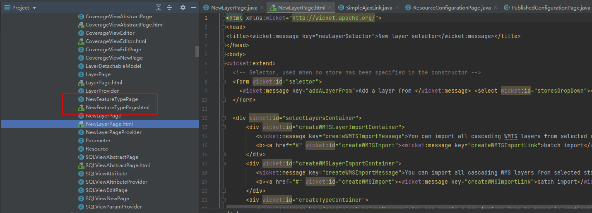
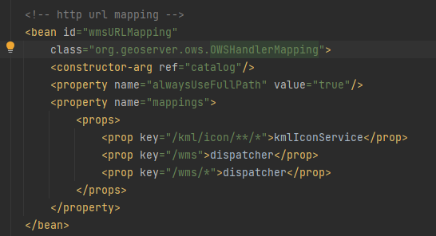
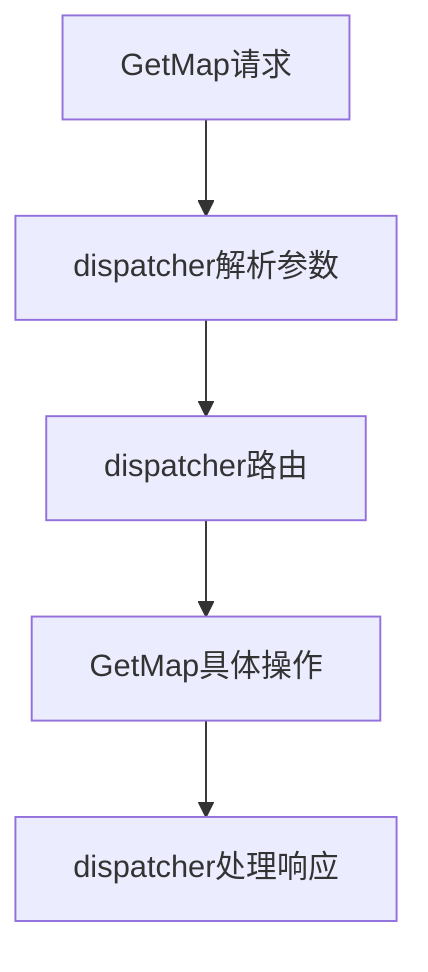

# <center>geoserver学习笔记</center>

- [geoserver学习笔记](#geoserver学习笔记)
  - [一、	Geoserver简介](#一geoserver简介)
  - [二、Geoserver页面](#二geoserver页面)
  - [三、Geoserver源码编译](#三geoserver源码编译)
  - [四、WMS服务](#四wms服务)
    - [3.1 GetCapabilities](#31-getcapabilities)
    - [3.2 GetMap](#32-getmap)
    - [3.3 GetFeatureInfo](#33-getfeatureinfo)
  - [五、WFS服务](#五wfs服务)
  - [六、WCS服务](#六wcs服务)
  - [七、WPS服务](#七wps服务)
  - [八、自定义开发](#八自定义开发)
  - [九、GeoServer项目结构](#九geoserver项目结构)


## 一、	Geoserver简介
&emsp;&emsp;Geoserver开始于2001年，是为了政府民主化的产物，使政府更加透明。Geoserver项目开展过程中又建立了GeoTools工具包。PostGIS以及OpenLayers等的出现增强了Geoserver功能。Geoserver的愿景还是使地理数据让所有人可以触及。    
&emsp;&emsp;Geoserver提供WMS、WFS以及WCS。WMS在服务器端渲染生成一张图片，返回给前端，可以处理矢量数据以及栅格数据。可以通过sld文件渲染矢量图形，且支持各种ESPG坐标系。WFS为返回图层矢量数据与属性，需要前端进行渲染；WCS为栅格数据的服务。以上三种服务为Geoserver默认自带的服务，Geoserver还提供一些扩展服务如：WPS、CWS等，这些服务默认不在Geoserver中需要另外安装。
## 二、Geoserver页面
&emsp;&emsp;Geoserver页面通过wicket框架搭建的，一个html对应一个java类，在java类中包括具体的方法修该设置html中的数据。

<p align="center">
  
</p>

&emsp;&emsp;Wicket操作类似于jquery，通过元素id获取元素wicket:id="selector"，然后对其进行操作。   
&emsp;&emsp;Geoserver使用了spring-web进行开发，在main模块下的applicationContext.xml中定义了不同url对应的处理器。如下图对/geoserver/ows请求会首先被OWSHandlerMapping处理，OWSHandlerMapping继承了SimpleUrlHandlerMapping，而	SimpleUrlHandlerMapping又继承了AbstractUrlHandlerMapping，AbstractUrlHandlerMapping具有注册handler的方法registerHandler，将在applicationContext.xml中定义的url与指定的controller类放在map中保存。OWSHandlerMapping即从map中获取与当前url匹配的controller，如果找到则将请求发给该controller，这里的controller即为org.geoserver.ows.Dispatcher.在Dispatcher中会根据请求的参数服务名称在spring容器中查找Service类型的类。利用spring的applicationContext的getBeanNamesForType方法根据类class获取bean名称。然后在根据请求的服务的version将service进行确认，如果没有指定version，则返回版本最高的。然后通过反射机制，调用service对象的请求指定的方法。调用完serveice方法后通过回调进行返回消息。

## 三、Geoserver源码编译
&emsp;&emsp;首先需要下载源码，在github上拉取geoserver源码。用idea打开src文件夹，在命令行中进入src目录下，运行`mvn -DskipTests clean install`跳过test编译项目,编译成功后用idea打开src目录，找到src下的web模块下的app包test下的web运行。也可以在idea中编译先clean然后install，需要选中跳过测试步骤。在idea中运行过程中可以修改data位置，在vm option中添加`-DGEOSERVER_DATA_DIR=D:\Data\geoserver_data`即可。如果编译成功，但运行时报错误，可能是data文件夹下的一些xml配置出现问题，可以将正常的xml文件替换掉有问题的xml文件即可。
## 四、WMS服务
&emsp;&emsp;WMS提供http请求获取地理图片服务。WMS服务的优点为，可以从多个服务器获取数据，然后再客户端将这些数据拼接起来。参考地址WMS reference — GeoServer 2.21.x User Manual
WMS主要提供一下内容   

| 操作 | 含义 |  
| ---- | ---- | 
| GetCapabilities | 关于服务信息，以及图层列表等 |
| GetMap	| 返回指定区域的图像 |		
| GetFeatureInfo	| 通过像素坐标获取当前位置的图形数据 |		
| DescribeLayer	| 对图层描述 |
| GetLegendGraphic	| 获取图例 |		

WMS服务主要业务逻辑代码存在package org.geoserver.wms文件中的，
DefaultWebMapService其实现了WebMapServie定义的接口，GetMap、GetFeatureInfo、GetCapabilities等。每中类型的操作都存在对应的类，并具有run方法，在类中run方法进行具体的操作，输入请求、输出格式以及回调等。如GetMap操作，有GetMap对象具体执行该操作，GetMapRequest为该请求的参数，GetMapOutputFormat为输出格式，GetMapCallback为回调。
### 3.1 GetCapabilities
&emsp;&emsp;GetCapabilites方法获取WMS服务的元数据，包括支持的操作、参数以及可用的图层等。示例：
http://localhost:8080/geoserver/wms?service=wms&version=1.1.1&request=GetCapabilities
Geoserver服务请求主要包括三个参数，service指定请求服务类型，version指定服务的版本，同一个服务具有多个版本，request为该服务具体的操作。这里使用的是WMS服务因此指定该服务的类型service=wms，指定版本为1.1.1，操作为GetCapabilites。如果没有指定版本号，默认为最新版本。
&emsp;&emsp;WMS具体操作在项目wms模块中。在wms模块中的applicationContext.xml文件中，定义了wms的hanlder通过OWSHandlerMapping进行处理，对应的controller为dispatcher，而dispatcher在main模块中的applicationContext.xml中定义。
<p align="center">
  
</p>

请求首先进入OWSHandlerMapping中，找到对应的controller，如果在handler中没有找到会在DispatcherServlet中寻找。找到controller即为dispatcher。在dispatcher中handleRequestInternal方法中处理请求。    
<p align="center">
  
</p>

1. 首先在init方法中解析请求参数信息；针对不同的服务会采用不同的解析器，解析器都需要继承KvpParser然后在application.xml中注册到spring中，在KvpUtil中根据请求服务类型、版本号、以及key选择具体的解析器，为了更快的匹配到解析器最好在定义解析器时指定服务类型以及版本号等信息。解析完成的结果仍然放在请求参数map对象中。GeoServerExtensions.extensions方法用来获取spring中指定类型的bean。
2. 然后在service方法中根据请求中服务名称以及版本号等信息获取对应的service，查找service具体方法为findService。每个服务具体名称、版本信息以及参数等在applicationContext.xml中的xxx-ServiceDescriptor名称的bean为org.geoserver.platform.Service实例中定义。加载所有的service然后根据当前请求的服务名称以及版本号进行查找符合要求的service。加载所有service操作在loadServices方法中，主要用到spring的ApplicationContext对象getBeanNamesForType方法获取所有Service类型的bean名称。然后在利用bean名称从ApplicationContext中获取对应的bean，通过GeoServerExtensions.extensions获取service类型的bean。每次请求都会进行以上操作，该过程会通过ConcurrentHashMap进行缓存以提高效率。这里找到的service是org.geoserver.wms.DefaultWebMapService。而找到的wms服务提供了10中操作,GetCapabilities、Capabilities、GetMap、Map、DescribeLayer、GetFeatureInfo、GetLegendGraphic、reflect、kml、animate。不同版本的WMS服务提供的操作不同。

<p align="center">
  
</p>

3. 获取请求操作对应的service中的方法，在dispatch方法中利用反射机制获取请求中request对应的方法这里即为GetCapabilites，获取到方法之后在组织方法所需的参数。Dispatch方法返回Operation对象，其中包含了service，method以及method所需的参数等信息。
4. 执行service，通过以上的准备，在execute中通过反射机制执行service中的具体方法。这里执行了DefaultWebMapService中的getCapabilities方法，而该方法调用了capabilities中的run方法，capabilities是通过spring依赖注入进来的。而capabilities中又注入了WMS对象，该对象则为WMS服务的一些详细信息，geoserver配置信息在GeoserverInfo中。执行service中的指定方法后返回TransformerBase对象。
5. 返回请求，执行response方法，将结果返回。首先获取不同方法的返回值的具体类型，然后将TransformerBase进行转换为具体的类型，写入到response中。这一步通过不同操作对应的reponse对象完成。这里通过Capabilities_1_3_0_Response完成。   

### 3.2 GetMap
&emsp;&emsp;GetMap通过http请求获取具有投影的图像：
示例： 
http://localhost:8092/geoserver/webgis/wms?service=WMS&version=1.1.0&request=GetMap&layers=webgis%3Astates&bbox=-124.73142200000001%2C24.955967%2C-66.969849%2C49.371735&width=768&height=330&srs=EPSG%3A4326&styles=&format=image%2Fjpeg
GetMap接口需要提供参数为，layers为图层名称 + workspace；bbox为图像的显示范围；width为输出图像的宽度；height为输出图像的高度，srs为坐标系；format为图像格式。概略步骤为，利用geotools创建mapContent，然后根据图层名称读取图层数据，将其添加到mapContent中，最后根据图像尺寸以及格式生成图像返回给前端。   



&emsp;&emsp;Geoserver采用wicket架构进行开发，需要继承wicket下的WebApplication，然后在类中重写goHomePage,跳转到主页面。Wicket一个类与一个html相对应。在html中定义的wicket:message需要在项目的properties文件中找对应的文本，不同语言具有不同的properties文件，因此可以实现页面不同语言的切换。 wicket:id需要对应的java文件中定义的元素进行替换，并定义操作事件。
GetMap主要业务逻辑定义在package org.geoserver.wms中的GetMap类中。其主要方法如下：
 
org.geoserver.ows为open web service，其中定义了请求参数，请求解析，以及响应等类。其中Dispatcher继承了AbstractController，会对所有的请求进行拦截处理。GetMap请求会首先被Dispatcher拦截处理，处理请求参数将不同类型的功能处理为对应类型的请求。然后GetMap请求到达DefaultWebMapService类，DefaultWebMapService类判断请求类型，然后调用GetMap类中的run方法。   
&emsp;&emsp;Geotools加载图层具体流程为首先创建DataStore，然后根据DataStore创建SimpleFeatureSoure，然后利用featureSource创建featureLayer，最后将layer添加到map中。在Geoserver中Dispatcher根据请求的具体类型选择KvpRequestReader进行具体图层读取，GetMap对应的KvpRequestReader为GetMapKvpRequestReader
在dispatcher中调用了DefaultWebMapService的getMap方法，在getMap方法触发了GetMap中run方法。run方法返回WebMap对象，该对象封装了mimeType、http请求头信息以及WMSWebContent。run方法内首先根据请求输出类型获取指定的GetMapOutputFormat子类，用来输出指定格式的图片。创建了GeoTools的MapContent对象，这里geoserver新创建了类WebMapContent对象继承了MapContent对象，添加了一些回调监听、参数等。GetMap方法可以用于免切片技术，每次请求都会创建MapContent，添加图层，生成图片等操作。GetMap请求可以分为栅格数据以及矢量数据类型，按照不同的输出格式可以分为openlayers、kml以及RenderImageMap等不同的格式。因此在GetMap类中的run方法中首先根据请求确定输出格式，获取GetMapOutputFormat接口的实现类，该实现类内部将mapcontent中的数据生成图片；接着在executeInternal方法中根据请求图层的类型加载该图层到mapcontent中。在executeInternal中对mapcontent根据请求范围以及坐标系进行设置。最后通过具体的GetMapOutputFormat实现类的produceMap生成WebMap对象。
### 3.3 GetFeatureInfo
&emsp;&emsp;通过像素点获取指定图层的要素信息, 返回FeatureCollection。GetFeatureInfo请求参数携带了当前视图地理范围、像素位置以及图层等信息。主要逻辑在GetFeatureInfo类处理，会加载identifiers类，根据当前的图层类型选择具体的identifiers对象，有矢量数据的identifier以及删除数据的identifier。identifiers对象中identify方法即可通过位置与图层获取FeatureCollection。
```js
http://localhost:8080/geoserver/wms?
request=GetFeatureInfo
&service=WMS
&version=1.1.1
&layers=topp%3Astates
&styles=
&srs=EPSG%3A4326
&format=image%2Fpng
&bbox=-145.151041%2C21.73192%2C-57.154894%2C58.961059
&width=780
&height=330
&query_layers=topp%3Astates
&info_format=text%2Fhtml
&feature_count=50
&x=353
&y=145
&exceptions=application%2Fvnd.ogc.se_xml
```
- 1、对于矢量图层，要素标识类为VectorBasicLayerIdentifier，首先需要将屏幕像素转换为地理坐标或投影坐标，通过bbox以及该范围的像素高宽即可求出每个像素代表的地理坐标大小，然后即可算出点击位置的具体地理位置。在识别要素时还需要以点击点做一点缓冲，即将点转换为以点为中心的正方形区块。如果要求的坐标系与该图层的坐标系不一致则需要进行坐标系转换。
## 五、WFS服务
&emsp;&emsp;WFS提供http请求获取、修改以及删除地理矢量数据服务。   
&emsp;&emsp;不同版本的WFS都会提供以下内容

| 操作	| 含义		|
| ---- |	----	|	
| GetCapabilities |	关于服务信息，以及图层列表等		|
| DescribeFeatureType |	获取关于要素类型信息描述		|
| GetFeature |	获取要素，几何信息以及属性信息		|
| LockFeature |	通过给要素添加锁防止被修改		|
| Transaction |	编辑要素	|

WFS2.0提供如下：
| 操作	| 含义		|
| ---- |	----	|	
| GetPropertyValue |	通过查询语法查询要素的属性信息		|
| GetFeatureWithLock |	获取关于要素并设置锁		|
| CreateStoredQuery |	创建仓库查询		|
| DropStoredQuery |	删除仓库查询		|
| ListStoredQueries |	列出仓库查询	|
| DescribeStoredQueries |	描述仓库查询	|


示例：
http://example.com/geoserver/wfs?service=wfs&version=1.1.0&request=GetCapabilities

## 六、WCS服务
&emsp;&emsp;WCS提供http请求处理遥感数据，WMS只是获取图像数据，而WCS会在原始数据上进行一些处理，如图像裁剪、波段运算等。   
&emsp;&emsp;WCS主要提供一下内容

| 操作 |	含义	|	
| ---- |	----	|	
| GetCapabilities |	关于服务信息，以及图层列表等		|
| DescribeCoverage |	返回xml格式关于数据详细描述		|
| GetCoverage |	返回栅格数据		|

示例：
http://www.example.com/wcs?service=wcs&AcceptVersions=1.1.0&request=GetCapabilities

以上三种服务为Geoserver默认自带的服务，Geoserver还具有WPS、CWS以及WMTS等需要安装的扩展服务。

WPS为地图计算服务，
http://localhost:8080/geoserver/ows?service=WPS&version=1.0.0&request=GetCapabilities
CSW为获取Geoserver中catlog中的数据


## 七、WPS服务

## 八、自定义开发
&emsp;&emsp;基于geoserver开发新的功能，在geoserver项目基础上开发新的功能模块，不影响现有的功能，需要以下几步：
- 1.创建模块   
&emsp;&emsp;在项目src目录下，新建一个maven模块取名为djdemo，修改djdemo模块pom.xml文件指定其父模块为org.geoserver;然后在web-app模块中依赖新建的模块。在新建的模块中添加需要引用的geoserver模块。
- 2.创建所需的类    
&emsp;&emsp;需要创建的类为新功能的主体类，处理具体的业务逻辑；请求解析类，将请求参数解析为具体的对象；响应封装类，封装处理结果，交给geoserver。这里定义了GPService类，里面包含具体的方法：getLengths以及getBuffers；定义解析请求参数的解析器，需要继承ows模块下的KvpParser，为了让spring找到该类；定义请求与响应类，响应需要继承ows模块下的response。
- 3.将其注入到spring中   
&emsp;&emsp;为了让spring管理新模块下的类，需要将其注入到spring中，在java目录下创建applicationContext.xml文件，将第二步创建的类需要放在spring的都要在xml文件中添加，以及依赖的geoserver中其他的bean。这里定义了gpService指向GPService，以及org.geoserver.platform.Service（用来描述gpService，其中包括服务类，服务名称以及版本号，还包括服务的具体方法），方便spring找到gpService；还有解析参数的类。

## 九、GeoServer项目结构
- 1、web模块主要为spring mvc的一些配置以及页面相关组件，采用wicket框架进行UI显示。在web模块下的app模块中web.xml中规定了在每个模块下加载applicationContext.xml文件，来初始化bean。
- 2、platform，在geoserver中有service，如WMS、WFS以及WMTS等，这些都属于服务；而服务下又包括Operation，如WMS服务下包括GetCapabilities以及GetMap等操作。geoserver将service以及operation进行抽象，不同的服务以及不同服务下的不同操作都需要继承service以及operation。而这些高级的抽象都在platform中定义的，可以认为platform定义了api规范，其他模块实现或引用这个api。
- 3、ows（OGC Web Services），开发服务，所有的请求都会先进入ows，然后进行参数解析封装，再转发到其他具体的服务，如：WMS、WFS等；最后服务返回结果，ows将结果返回给客户端。ows类似网关概念，所有请求都从这进来，所有的相应也都从这出去。ows主要定义了request、response以及kvparser等。ows中的Dispatcher作为http请求调度员，会对接受的服务进行请求参数解析，根据参数找到指定的service以及operation，然后通过反射机制调用服务下的操作。
- 4、main，定义了catalog、filter以及系统配置等。catalog中定义了layer、map、workspace、store等概念。
- 5、wms（web map service），网络地图服务
- 6、wfs（web feature service），网络要素服务
- 7、wcs（web coverage service），网络覆盖服务
- 8、secuity，安全相关
- 9、kml，
- 10、gwc（GeoWebCache），服务缓存
- 11、extensions，一些扩展功能