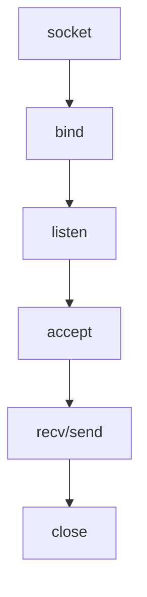
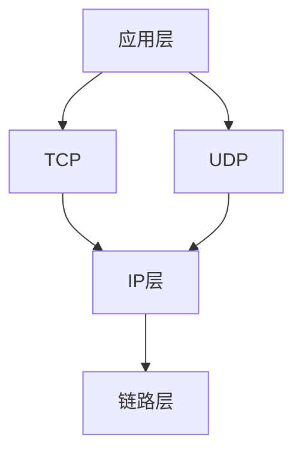

# 
Web学习

# cookie
&emsp;&emsp;由于web采用http请求是无状态的，因此客户端与单一服务器实例不存在绑定关系，可以切换其他的服务器实例。但服务器很难知道当前客户端的信息，因此在客户端保存一些小数据，记录客户的某些信息，在发送请求时携带这些数据，告诉服务器当前客户端的一些信息。这些小数据即为cookie。cookie可以永久保存在客户端或保存设定的期限。按照存储内容可以将cookie分为token类型的cookie以及签名cookie，token的cookie仅保存token，没有具体含义。签名cookie保存的加密后的用户信息，服务端可以进行解密获取用户信息。cookie存在一些属性：expires、path、domain、secure、httponly.cookie存在很多安全隐患如CSRF攻击、恶意cookies、cookie捕获等。cookie是针对站点的，当访问该站点时会携带对应的cookie。

# tinyhttpd
&emsp;&emsp;tinyhttpd是J. David Blackstone在1999年用C实现的简单的web服务器，tinyhttped项目结构，主体文件位httpd.c,大约500行，simpleclient.c为简单的客户端，httped可执行文件为编译输出的文件，htdocs包含CGI脚本以及html文件。运行起来tinyhttp之后，在界面填写颜色，确认会跳转到新界面背景色为填写的颜色，这里执行了cgi脚本。  

  
图1.1 tinyhttpd项目结构

- 1、sockaddr_in
sockaddr_in是包含port以及address的结构体。

- 2、startup
tinyhttped通过startup启动一个进程监听客户端的连接，需要输入端口作为参数，并返回socket id。如果参数为0则自动生成一个随机数作为端口。调用socket()方法返回指向该socket的文件描述（FD），如果返回-1则创建socket失败。这个socket用于监听并接收客户端请求。创建成功socket然后设置sin_family、sin_port以及sin_addr。htons\htonl将无符号短\长整型转换为网络字节顺序，大段模式。之所以需要转化因为，计算机表示存在两种字节顺序，网络字节顺序（NBO）以及主机字节顺序（HBO）。要实现数据在网络中传输需要统一为网络字节顺序，但不同电脑cpu结构不同对相同数据表示的主机字节顺序不同，因此需要进行字节顺序的转换。相反ntohs即将网络字节顺序转换为主机字节顺序。然后，将创建好的通信地址与端口号与创建的sokcet进行绑定，bind(socket, socketaddr, addr_len).然后调用getsocketname(socket, socketaddr, addr_len),用于获取一个套接字的名字。它用于一个已捆绑或已连接套接字s，本地地址将被返回.最后调用listen(socket, N),准备接受发送到该socket上的连接, tcp三次握手在listern中完成。N connection requests will be queued before further requests are refused.即N为排队的个数，进入该队列的客户端即进入等待状态，如果超过这个个数其他的请求则会被拒绝。listen完成之后就可以accept请求了。

图1.2 socket生命周期

- 3、socket参数
  - 3.1 参数1 domain   
socket使用的通信协议族常见协议簇为：  
AF_UNIX（本机通信）  
AF_INET（TCP/IP – IPv4）  
AF_INET6（TCP/IP – IPv6）  
  - 3.2 参数2 type  
套接字的类型，常见有：  
SOCK_STREAM（TCP流）  
SOCK_DGRAM（UDP数据报）  
SOCK_RAW（原始套接字）
  - 3.3 protocol
协议，如果协议簇以及socket类型确定了，那protocol也固定了，设置为0即可。

- 4、accept  
&emsp;&emsp;accept用来对创建的socket句柄，并获取客户端的addres以及客户端的addres长度。返回新的socket描述，这个socket与创建的服务端的socket（用于监听请求）不一样，每个请求会生成新的socket。如果socket描述为-1则接收请求错误。socket是操作系统提供的用于网络数据传输的软件，socket类似于文件操作读、写以及关闭。socket结构为四元组{对方addres:对方port, 本机addres:本机port}，tcp类型socket为五元组{对方addres:对方port, tcp, 本机addres:本机port}。按照分工可以将socket分为两类，监听socket以及已连接socket。监听socket对方addres以及对方port都为*通配符，可以接受任意设备连接，不进行用户网络数据的传输，用来监听并接收客户端的请求，负责进行三次握手（请求也是一种网络数据），并创建连接客户端的socket，由客户端的socket进行用户数据的传输。已连接socket对应一个请求，已连接的socket都为成对即在服务端有一个socket，在客户端也有一个socket，成对的socket进行数据的读写操作，进行网络数据传输。而udp不是面向连接的，客户端发送，服务端接收，服务端不会fork新的socket处理请求。tcp于udp可以公用相同的端口号，udp不会监听端口。

- 5、recv  
&emsp;&emsp;recv用来从socket中读取数据。socket中具有缓冲区在数据满了时一次性读取，并不会有数据来了就读取。

- 6、send  
&emsp;&emsp;send用将数据通过socket发送给对方。

- 7、tcp/ip
标准对技术发展起着举足轻重的作用。TCP原理包括：数据缓冲区、三次握手、四次挥手。

图1.3 TCP/IP协议栈

- 8、TCP的半关闭  
在TCP传输过程中，如果一方关闭socket，则对方发送必须接收的数据无法接收到，因此只关闭一部分数据流，使得socket可接收数据但无法发送，或可发送数据但无法接收。socket的创建并建立连接之后，拥有两个流：输入流以及输出流。输入流与对方输出流连接，输出流与对方输入流连接。关闭一半即为关闭其中一个流。而close(socket)则关闭两个流。使用shutdown(socket, SHUTDOWN_RD|SHUTDOWN_WR|SHUTDOWN_RDWR)

- 9、域名与IP  
电脑中会带有默认域名服务器的地址，用域名服务器将域名转换为ip。在c语言中可以用gethostbyname获取域名对应的ip，或通过gethostbyaddr根据ip获取域名。

- 10、socket参数设置  
根据需要可以对socket设置参数，如缓冲区大小，time-wait(主动断开方会经过time-wait)、nagle算法(传输大文件可以禁用nagle算法)。

- 11、并发通信
多进程、多路复用以及多线程都可以实现并发通信。c中可以通过fork创建进程。如果父进程比子进程晚结束，则子进程就变为僵尸进程，因此需要父进程收回子进程。java在语言层面实现了进程和线程，为实现跨平台，而c则利用操作系统提供的线程与进程创建。通过signal监听子进程停止事件通知。

- 12、进程间通信
基于管道实现进程间通信。pipe可以创建一个通道，一个通道可以进行双向通信。匿名管道必须在父子进程之间进行使用，如果两个进程无关则没有办法使用匿名管道。如果要在两个无关的进程之间进行通信可以使用命名管道FIFO.