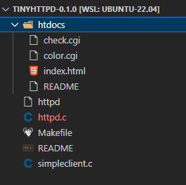

# 
Web学习

# cookie
&emsp;&emsp;由于web采用http请求是无状态的，因此客户端与单一服务器实例不存在绑定关系，可以切换其他的服务器实例。但服务器很难知道当前客户端的信息，因此在客户端保存一些小数据，记录客户的某些信息，在发送请求时携带这些数据，告诉服务器当前客户端的一些信息。这些小数据即为cookie。cookie可以永久保存在客户端或保存设定的期限。按照存储内容可以将cookie分为token类型的cookie以及签名cookie，token的cookie仅保存token，没有具体含义。签名cookie保存的加密后的用户信息，服务端可以进行解密获取用户信息。cookie存在一些属性：expires、path、domain、secure、httponly.cookie存在很多安全隐患如CSRF攻击、恶意cookies、cookie捕获等。cookie是针对站点的，当访问该站点时会携带对应的cookie。

# tinyhttped
&emsp;&emsp;tinyhttped是J. David Blackstone在1999年用C实现的简单的web服务器，tinyhttped项目结构，主体文件位httpd.c,大约500行，simpleclient.c为简单的客户端，httped可执行文件为编译输出的文件，htdocs包含CGI脚本以及html文件。运行起来tinyhttp之后，在界面填写颜色，确认会跳转到新界面背景色为填写的颜色，这里执行了cgi脚本。  

- 1、sockaddr_in
sockaddr_in是包含port以及address的结构体。

- 2、startup
tinyhttped通过startup启动一个进程监听客户端的连接，需要输入端口作为参数，并返回socket id。如果参数为0则自动生成一个随机数作为端口。调用socket()方法返回指向该socket的文件描述（FD），如果返回-1则创建socket失败。创建成功socket然后设置sin_family、sin_port以及sin_addr。htons\htonl将无符号短\长整型转换为网络字节顺序，大段模式。之所以需要转化因为，计算机表示存在两种字节顺序，网络字节顺序（NBO）以及主机字节顺序（HBO）。要实现数据在网络中传输需要统一为网络字节顺序，但不同电脑cpu结构不同对相同数据表示的主机字节顺序不同，因此需要进行字节顺序的转换。相反ntohs即将网络字节顺序转换为主机字节顺序。然后，将创建好的通信地址与端口号与创建的sokcet进行绑定，bind(socket, socketaddr, addr_len).然后调用getsocketname(socket, socketaddr, addr_len),用于获取一个套接字的名字。它用于一个已捆绑或已连接套接字s，本地地址将被返回.最后调用listen(socket, N),准备接受发送到该socket上的连接。N connection requests will be queued before further requests are refused.即N为排队的个数，如果超过这个个数其他的请求则会被拒绝。listen完成之后就可以accept请求了。

- 3、socket
  - 1、参数1 domain   
socket使用的通信协议族常见协议簇为：  
AF_UNIX（本机通信）  
AF_INET（TCP/IP – IPv4）  
AF_INET6（TCP/IP – IPv6）  
  - 2、参数2 type  
套接字的类型，常见有：  
SOCK_STREAM（TCP流）  
SOCK_DGRAM（UDP数据报）  
SOCK_RAW（原始套接字）
  - 3、protocol
协议，如果协议簇以及socket类型确定了，那protocol也固定了，设置为0即可。