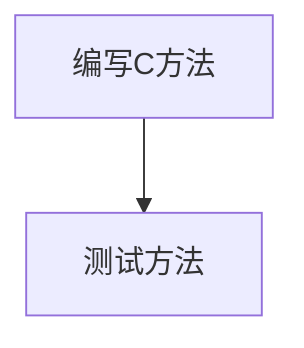

# 关于vscode中的markdown文件编辑于预览
- 1、标题，一级为#,二级为##，井号越多等级越低
- 2、加粗，**dj**
- 3、斜体，*dj*，或 _dj_
- 4、删除，~~dj~~
- 5、引用， 
 >> djxc
- 6、分割线
---
- 7、图片，安装markdown all in one插件，将png拖到编辑位置即可  
 

- 8、超链接[百度](http://baidu.com 'bd')
- 9、无序列表，- + * 跟内容之间都要有一个空格
- 无序嵌套
   - 1
   - 2
   - 3
- 10、有序列表，序号跟内容之间要有空格   
   1. dj
   2. xc
   3. jm
- 11、表格

| 表头 | 表头 | 表头 |
| --- | --- | --- |
|第一行|第一行|第一行|
|第二行|第二行|第二行|
|第三行|第三行|第三行|

- 12、代码
```javascript
let a = 10;
```

- 13、meoji表情，需要安装markdown emoji插件，:beer: :)
- 14、mermaid流程图，需要安装markdown preview mermaid support，


