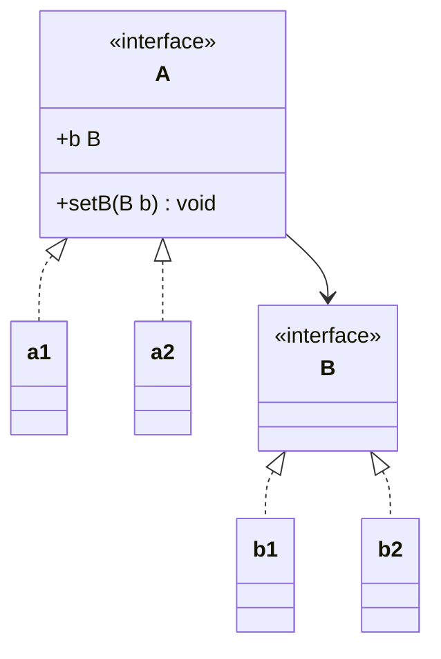
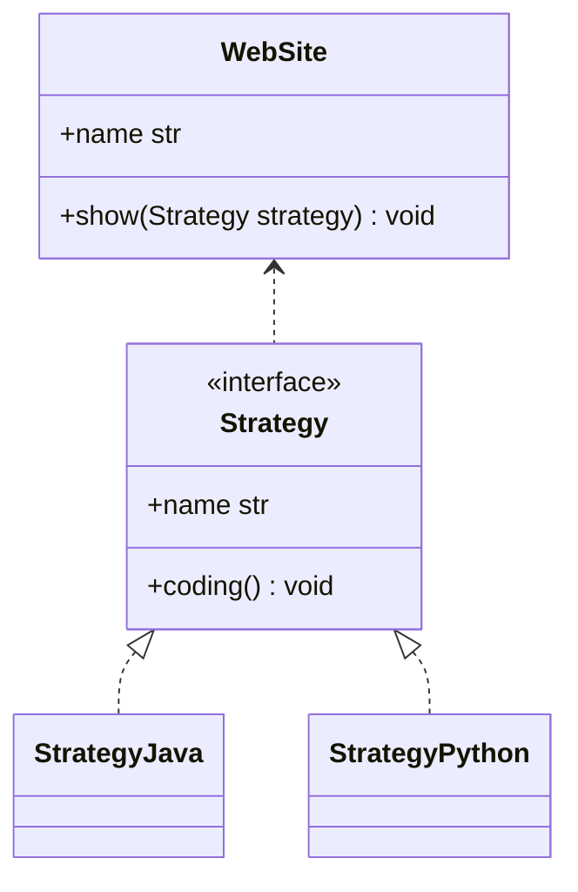

# 设计模式学习
&emsp;&emsp;设计模式是前人通过经验获取到的，对于项目易于理解、可扩展、可维护具有重要意义。本文通过python进行设计模式的学习。主要的设计模式分为23种，按照其作用又可以分为三大类：创建类设计模式、结构类设计模式、行为类设计模式。  
&emsp;&emsp;设计模式方法论则是设计原则，设计模式是设计原则的具体体现。设计原则包括单一职责原则、里氏替换原则、依赖倒置原则、接口隔离原则、迪米特拉法则、开闭原则。


- 1、单例模式  
如果项目中仅需要有一个实例化类的对象，其他方法获取该实例调用其中方法。单例模式为类自身控制其实例化，在java中可以提供public的静态方法用来获取实例，在python中需要在__new__函数中判断该类是否实例化过，如果没有则调用__new__方法，否则直接返回已创建的实例。单例模式的适用情况：
  - 1、生成全局惟一的序列号；
  - 2、访问全局复用的惟一资源，如磁盘、总线等；
  - 3、单个对象占用的资源过多，如数据库等；
  - 4、系统全局统一管理，如Windows下的Task Manager；
  - 5、网站计数器。
```python
class Singleton(object):  
    def __new__(cls, *args, **kw):
        if not hasattr(cls, '_instance'):
            orig = super(Singleton, cls)
            cls._instance = orig.__new__(cls, *args, **kw)
        return cls._instance
```

- 2、工厂模式  
工厂模式分为简单工厂模式，工厂方法模式以及抽象工厂模式。简单工厂模式提供一个创建产品的方法，任何产品的创建都采用一个方法。简单工厂模式根据创建方法的参数判断具体创建哪个产品。如果要新增产品则需要修改工厂类，不符合“开放-封闭原则”。工厂方法模式，有一个抽象工厂类，针对不同的产品创建具体的工厂类，在具体工厂类中创建产品。如果新增产品则新增产品对应的工厂类继承抽象工厂，符合“开放-封闭原则”.

- 3、创建者模式  
创建者模式将对复杂步骤的操作放在创建者中，由创建者操作。创建者模式还可以通过director类控制创建者工作流程，对于不同工作流程可以创建不同的director。创建者模式使用场景：
  - 1、目标对象由组件构成的场景中
  - 2、对象内部接口需要根据不同的参数而调用顺序有所不同时

- 4、原型模式  
原型模式将为简单，即将当前对象拷贝一份，不需要重新创建，保留原来的信息。拷贝又分为深度与浅度。在python中直接调用对象的.clone()方法，或是deep_clone()即可.

- 5、代理模式  
为某类提供一个代理，以控制对此对象的访问和控制。代理类与被代理类都继承相同的父类，即代理类与被代理类包含相同的属性和方法，客户端调用代理类中与抽象类同名方法时会先完成新增的业务，然后调用真实的被代理对象的方法。代理模式有利于对原有的功能进行扩展，而被代理类职责单一。

- 6、装饰器模式  
给已有的对象添加额外的功能，需要首先实例化一个对象，将建好的对象传给装饰器，客户端调用装饰器的方法，在装饰器中增加新的业务逻辑。装饰器没有采用继承方式对类增加新的功能，但比继承更为灵活。装饰器与代理模式有很大的共同点：都包括与已有类的相同接口。不同点在python中用@装饰器较为好理解，代理模式对客户端来说操作的是代理对象，被代理的对象称为了代理对象的一个属性；装饰器模式对客户端来说还是调用被装饰器，只不过在调用过程中因为有@的原因会在调用被装饰对象方法时装饰器对象会将被装饰对象包裹在其方法中，对客户端来说调用的还是被装饰类。

- 7、适配器模式  
适配器模式是在已有的代码中将两个不相关的类可以相互调用，在设计过程中不应该使用该模式。如果A抽象类类有getName方法B抽象类有get_name方法要让A实现类可以调用B方法，则需要创建一个适配器类实现A抽象类，并在适配器中调用B类的实现方法。即将B类功能融入到A类中。

- 8、门面模式  
门面模式又称为外观模式（facade），一个系统对外提供一个门面，该门面融合了该系统多个功能，对于客户端来说只是一个门面类似于API。

- 9、组合模式
像树状数据结果，有根节点与子节点。

- 10、享元模式
享元模式位一个系统内共同享有一个对象的思想，可以减少对象的创建，提供内存使用。共享的对象属性应该是公共的不会随着环境而变化。

- 11、桥梁模式  
桥梁模式中包含A抽象角色以及B实现化角色，抽象角色定义要做某件事，实现化角色定义了具体如何去做。抽象角色需要包含实现化角色，但二者又可以随意变化，互不影响。a1与a2都实现了A的抽象方法，客户端可以使用a1或a2，A引用了B，客户端可以把b1给A也可以把b2给A。A的实现与B的实现互不影响。
<center>


</center>
 
- 12、策略模式
策略模式与桥梁模式很相似，一个类具有某些功能，这个功能需要一种策略类，因此可以给他传入不同的策略类的实例完成不同的任务。策略类类似于桥梁模式的实现化角色，策略模式相对于桥梁模式少了抽象角色。
<center>


</center>

- 13、责任链模式  
如果一个请求可能被不同的对象进行处理，则适用于责任链模式，责任链模式将请求者与处理者分离，每个处理对象类似于一个node，每个node又包含上一级的node。每一级node处理当前请求，如果处理不了则交给上一级进行处理。

- 14、命令模式

- 15、中介模式
- 16、模板模式
- 17、迭代器模式
- 18、访问者模式
- 19、观察者模式
- 20、解释器模式
- 21、备忘录模式
- 22、状态模式
