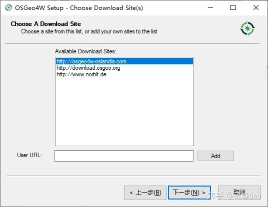
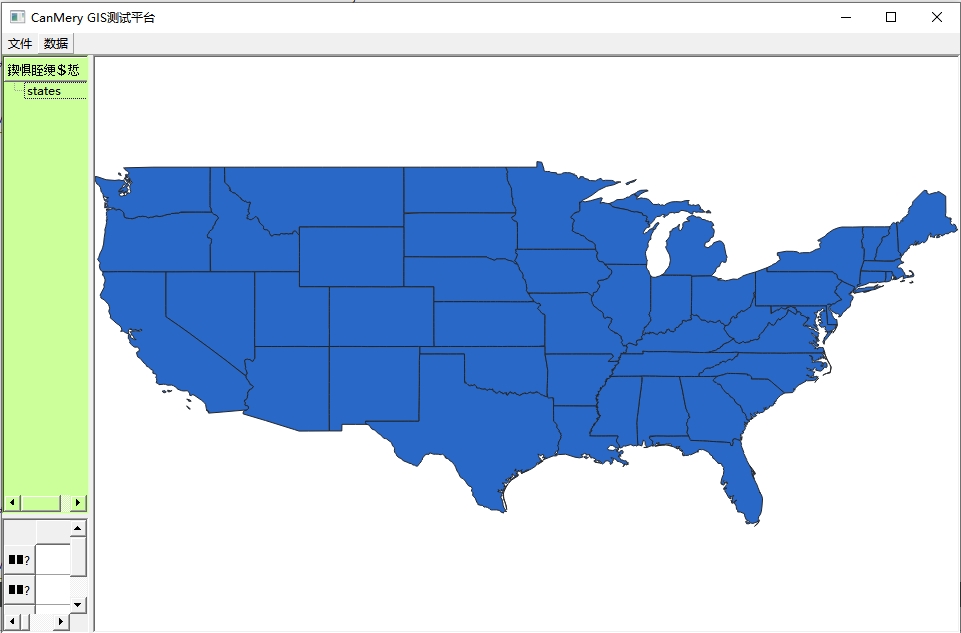

# 学习GIS开发
## 1、	环境搭建
&emsp;&emsp;在windows下，采用qt + qgis二次开发。
### 1.1	osgeo4w安装依赖
&emsp;&emsp;下载osgeo4w安装包，安装过程中，搜索qgis，选择lib下的所有依赖，进行下载，下载速度很慢，很容易失败可以选择不同网址重新尝试。
<p align="center">
  
</p>

### 1.2 vs2017安装
&emsp;&emsp;由于在qt中采用了msvc需要安装vs，可以根据具体版本安装。安装完vs之后即可在qtcreator中选项对话框中查看编译器
### 1.2 qt的单独安装
&emsp;&emsp;在步骤1中安装目录下包含了qt，尝试过VS下进行qt+qgis开发，一直有各种问题，然后重新下载了qt，用qtcreator成功运行qgis程序。首先需要在qtcreator中测试可以正常启动widgets项目，qt版本采用独立安装的qt，最好不用osgeo4w安装的qt。然后配置qgis依赖，在项目pro文件中添加以下（具体路径按实际情况修改）：
```yml
# qgis
INCLUDEPATH += "D:\Program Files (x86)\OSGeo4W64\include"
INCLUDEPATH += "D:\Program Files (x86)\OSGeo4W64\apps\qgis-ltr\include"
LIBS += -L"D:\Program Files (x86)\OSGeo4W64\apps\qgis-ltr\lib" -lqgis_core -lqgis_gui
```
&emsp;&emsp;编写qgis示例程序，可能会报error C2065: “M_PI”: 未声明的标识符，则需要在pro中添加DEFINES += _USE_MATH_DEFINES；还有可能报error: C2001: 常量中有换行符错误则需要在pro文件中添加QT += xml  
&emsp;&emsp;至此，在windows下的qtcreator + qt + qgis开发环境安装成功，
<p align="center">
  
</p>
 
